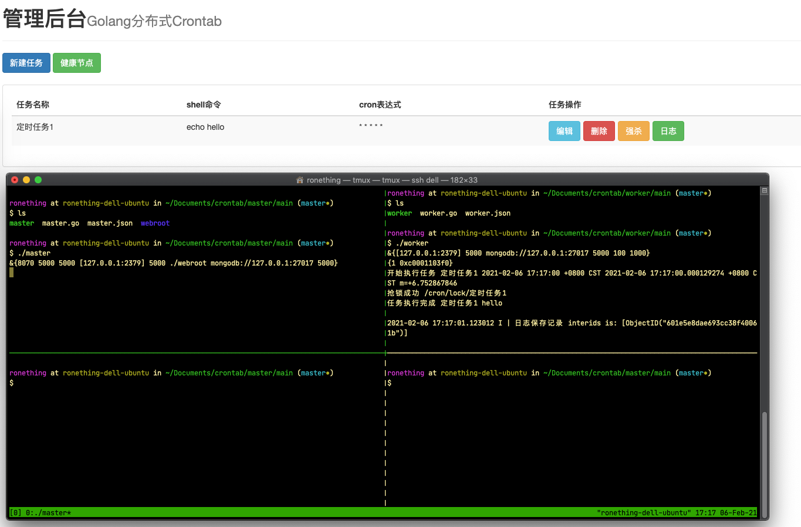

<!-- START doctoc generated TOC please keep comment here to allow auto update -->
<!-- DON'T EDIT THIS SECTION, INSTEAD RE-RUN doctoc TO UPDATE -->
**Table of Contents**  *generated with [DocToc](https://github.com/thlorenz/doctoc)*

- [crontab](#crontab)
  - [依赖](#%E4%BE%9D%E8%B5%96)
    - [etcd](#etcd)
    - [mongodb](#mongodb)
  - [架构](#%E6%9E%B6%E6%9E%84)
    - [master](#master)
    - [worker](#worker)
  - [效果](#%E6%95%88%E6%9E%9C)
  - [致谢](#%E8%87%B4%E8%B0%A2)
  - [TODO](#todo)

<!-- END doctoc generated TOC please keep comment here to allow auto update -->

# crontab

golang 实现分布式任务调度系统

## 依赖

etcd、mongodb

### etcd

https://github.com/etcd-io/etcd

### mongodb

https://github.com/mongodb/mongo

## 架构

### master

### worker

## 效果

## 致谢

https://yuerblog.cc

## TODO

- [ ] 任务超时控制
- [ ] 任务执行错误/超时进行告警
